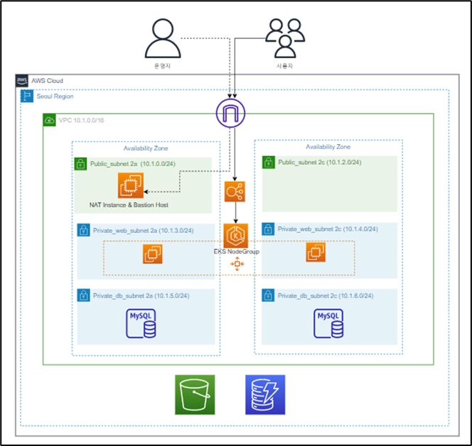
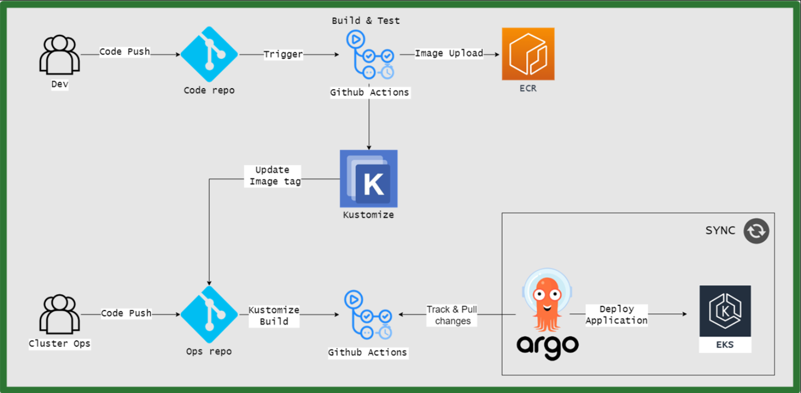
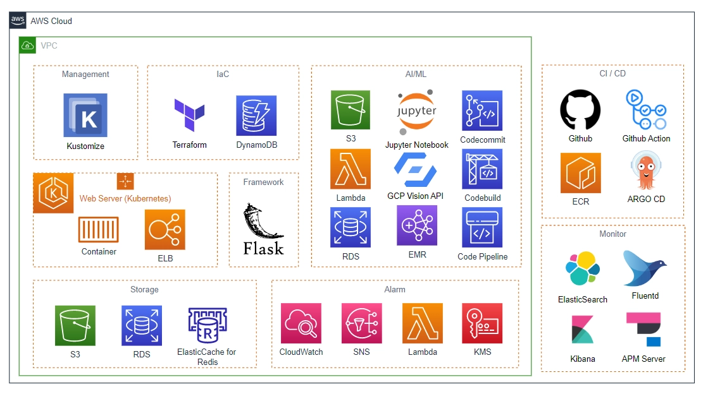
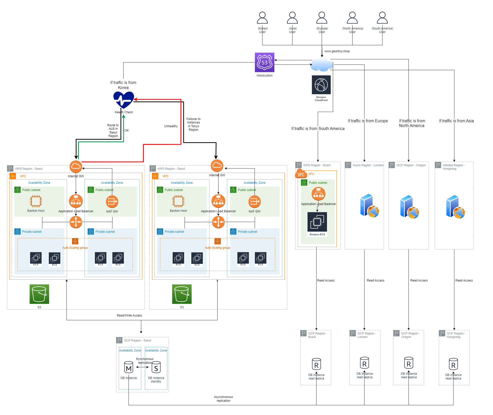
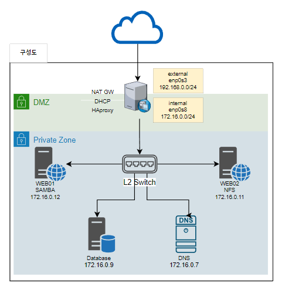

> ☁️ 2022년 KOSA 클라우드 솔루션즈 아키텍트 양성과정을 수강하며 진행한 프로젝트 내용을 담고 있습니다.

## 교육과정 커리큘럼
| 구분 | 교육 내용 | 시간 |
| :--- | :--- | :---: |
| **실무 기초** | 인프라스트럭처 개요 | 8 |
| | 온프레미스 인프라스트럭처 | 8 |
| | 클라우드 컴퓨팅 | 8 |
| | 운영체제 | 24 |
| | 네트워크 | 24 |
| | 데이터베이스 | 24 |
| | 세미프로젝트 1 (온-프레미스 네트워크 및 서버 환경 설계 및 구축) | 40 |
| **실무 심화** | Python / GO Lang | 80 |
| | 가상화 (하이퍼바이저 / 오픈스택) | 56 |
| | 퍼블릭 클라우드 (AWS, GCP, Azure, Alibaba) | 120 |
| | 클라우드 보안 / 컴플라이언스 기초 | 24 |
| | 세미프로젝트 2 (퍼블릭, 프라이빗 융복합 멀티클라우드 설계 및 구축) | 40 |
| **실무 특화** | Terraform / Ansible | 40 |
| | Docker & Container (+MSA) | 40 |
| | Kubernetes | 80 |
| | CI / CD (Jenkins, Gitlab) | 24 |
| **프로젝트** | 애자일 개발 환경을 위한 DevOps CI/CD 파이프라인 자동화 프로젝트 | 320 |
| **합 계** | | **960** |

## 최종 프로젝트
**2022.08 ~ 2022.09**  

- 팀명: 브로컬리
- 주제: 식품 쇼핑몰 인프라 설계 및 구축
- 인원: 총 4명(IaC / EKS, CI/CD / Monitoring / AI)

- OS 및 DB: Amazon Linux2, RDS, DynamoDB
- 프로젝트 소개: 국내외로 이커머스 시장이 크게 성장하고 있고 이커머스 시장에서 빠른 확장과 효율적인 운영을 위해 클라우드가 도입되고 있습니다. 브로컬리 팀은 한 고객사로부터 클라우드 네이티브 온라인 쇼핑몰 구축 의뢰를 받습니다.
- 인프라 구성도:  
- CI/CD Pipeline 구성도:  

### ✔️What I Did

 **EKS 기반의 GitOps**

- 요구사항:
    1. 저희 웹 개발 팀은 MSA로 서비스를 개발 중이에요. 소스코드는 Github Enterprise로 관리하고 있는데, 익숙한 것을 계속 쓰고 싶어요.
    2. 확장성을 생각했을 때 컨테이너 워크로드로 쿠버네티스를 쓰고싶어요. 하지만 저희 팀에는 쿠버네티스를 잘 모르는 팀원도 있습니다.
    3. 적은 인원으로 운영과 개발 업무를 수행해야 합니다. 개발/테스트/스테이징/프로덕션 서버 모두 운영하는 것은 너무 번거로워요! 하지만 고객이 에러를 경험하지 않았으면 좋겠어요.
    4. 새로운 요청이 들어왔을 때, 변경 사항을 빠르게 적용해야 해요.  인프라와 CI/CD 구축을 도와주세요.
- 사용 스택:
    - Github
    - Github Actions
    - ECR
    - Kustomize
    - ArgoCD
    - Argo Rollouts
    - EKS (ExternalDNS, Ingress)

### ✔️최종 개발환경 및 사용도구

## 세미프로젝트 2

## 세미프로젝트 1

