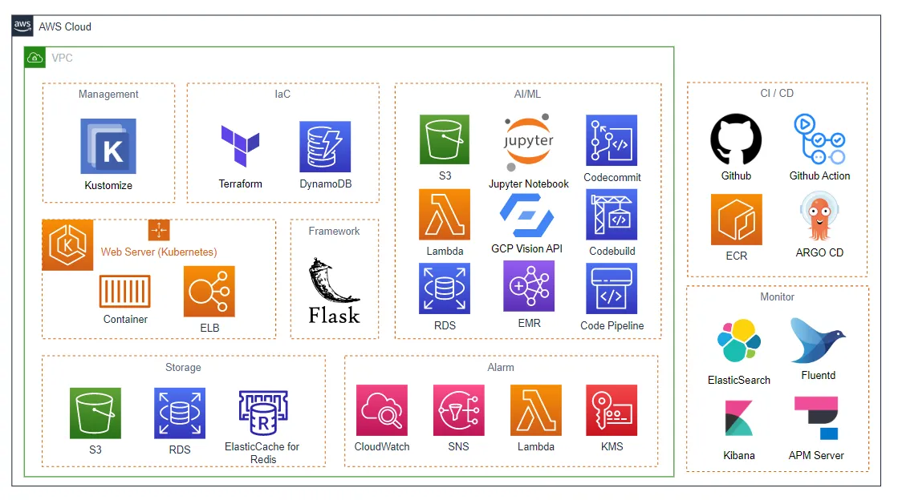

# Final Project 
DevOps CI/CD 파이프라인 자동화 프로젝트

## ✅ 개요
국내외로 이커머스 시장이 크게 성장하고 있고 이커머스 시장에서 빠른 확장과 효율적인 운영을 위해 클라우드가 도입되고 있습니다. 브로컬리 팀은 한 고객사로부터 클라우드 네이티브 온라인 쇼핑몰 구축 의뢰를 받습니다.

## 📷 아키텍처 다이어그램

## 📂 구성
- `src/`: 프로젝트 소스 코드, 구성 스크립트 및 설정 파일
- `images/`: 아키텍처 및 기타 참고 이미지

## ⚙️ 사용 기술

- Github
- Github Actions
- ECR
- Kustomize
- ArgoCD
- Argo Rollouts
- EKS (ExternalDNS, Ingress)